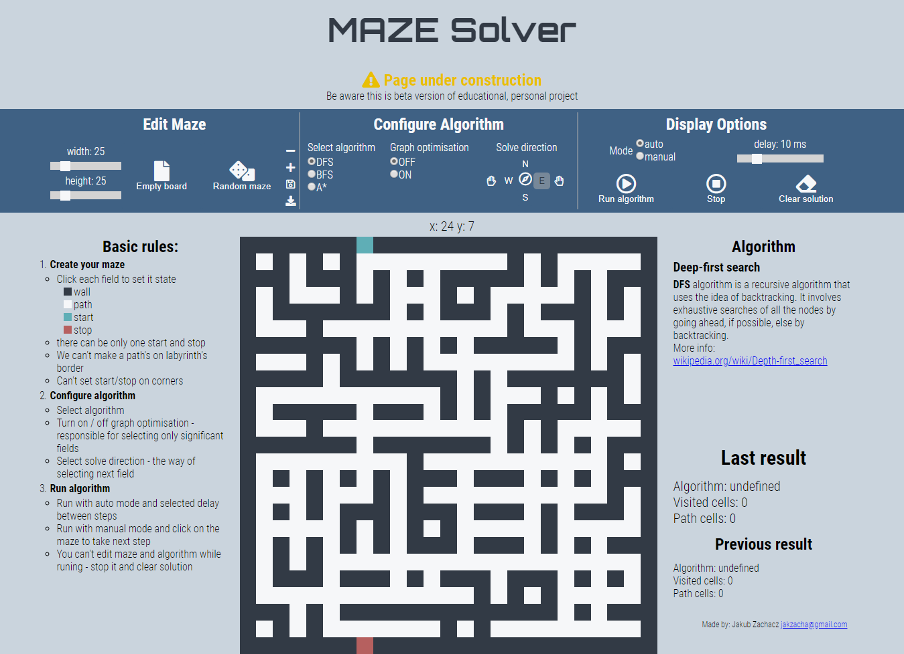

# MazeSolver
## Educational project to show differences between basic graph search algorithms, with maze editor and algorithm customization options.

[Live demo - Try me!](https://kubazachacz.github.io/MazeSolver/ "Maze Solver")

### Skills required:
- algorithms
- JS ES5 

### TODO:
Clean up the mess in the code with ES6.

Legacy repo: [https://github.com/chaczyk113/MazeSolver](https://github.com/chaczyk113/MazeSolver "chaczyk113")